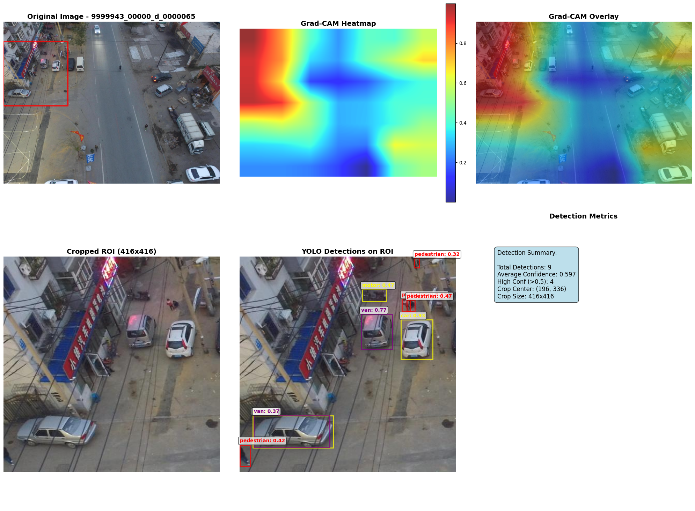

# Attention-Guided Object Detection with Grad-CAM++ and YOLO

## Overview
This project combines **Grad-CAM++ (Gradient-weighted Class Activation Mapping)** with **YOLO (You Only Look Once)** to enhance object detection performance on the **VisDrone dataset**. The workflow uses Grad-CAM heatmaps to identify regions of interest (ROIs) in drone imagery, then applies YOLO to detect and classify objects within those regions. The approach is designed to improve focus on highly activated areas, potentially leading to more reliable detections in cluttered, aerial environments.

Attached images in the results folder demonstrate how the pipeline processes input images: generating heatmaps, cropping ROIs, and overlaying YOLO detections.

---

## Dataset: VisDrone
The **VisDrone dataset** is a large-scale benchmark for object detection and tracking in drone-captured imagery. It contains complex urban and suburban scenes, often with:
- Small-scale pedestrians, vehicles, and bikes
- Heavy occlusion
- Crowded backgrounds
- Diverse illumination and weather conditions

The dataset provides **11 annotated object categories**:
- Pedestrian, people, bicycle, car, van, truck, tricycle, awning-tricycle, bus, motor, and others.

This project uses a trained YOLO model (`best.pt`) fine-tuned on VisDrone data. The validation subset was processed for experiments.

---

## What Was Done
1. **Model Setup**  
   - Loaded a pre-trained **ResNet-50** for Grad-CAM++ heatmap generation.  
   - Loaded a **YOLO model (best.pt)** trained on VisDrone.  

2. **Grad-CAM Heatmaps**  
   - Grad-CAM++ applied to ResNet-50 last convolutional layer.  
   - Heatmaps highlight semantically important regions for classes such as car, cat, and ship (multi-class targets encourage strong activations).  

3. **ROI Cropping**  
   - Computed weighted activation centers from Grad-CAM maps.  
   - Cropped fixed-size (416×416) regions around high-activation zones.  
   - Preserves consistent input size for YOLO inference.  

4. **YOLO Detection**  
   - Ran YOLO inference on cropped ROIs.  
   - Detections plotted with bounding boxes, class labels, and confidence scores.  

5. **Metrics & Evaluation**  
   - Calculated **AP (Average Precision), mAP, precision, recall, and F1-score**.  
   - Generated per-image and aggregated summary metrics.  
   - Results saved to CSV and visualizations exported (heatmaps, cropped ROIs, and detection overlays).  

---

## Results
**Summary Statistics (from 10 validation images):**
- Mean AP: **0.4898**  
- Std AP: **0.1939**  
- Mean detections per image: **7.7**  
- Total detections: **77**  
- Mean confidence: **0.5442**  
- Detection rate: **90% of images contained detections**

**Per-Image Highlights:**
- Best performing image achieved AP of **0.71** with 15 detections.  
- Lowest performing image had no detections (AP = 0).  
- Most images clustered in the **medium-to-high AP range** (0.4–0.7).  

The attached sample outputs illustrate:
- Grad-CAM heatmaps guiding the crop region.  
- Cropped ROIs fed into YOLO.  
- YOLO detections overlayed on top of cropped regions.  
- Detection metrics summarized for each image.  

This workflow demonstrates how attention-based localization (via Grad-CAM) can guide object detection pipelines on aerial datasets, where irrelevant background often dominates.

---

## Why This Was Done
Object detection in drone imagery is difficult because:
- Objects are small, often <1% of the image area.  
- Background clutter (roads, rooftops, vegetation) overwhelms detection models.  

By combining **attention-driven cropping** (Grad-CAM) with **robust detection** (YOLO), the pipeline aims to:
- Improve focus on meaningful image regions.  
- Reduce computation on irrelevant background.  
- Provide interpretable heatmaps for detection decisions.  

---

## License
This project is released under the **MIT License**.  
It is fully open-source and contributions are encouraged.  

